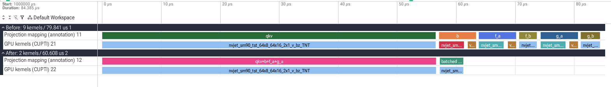
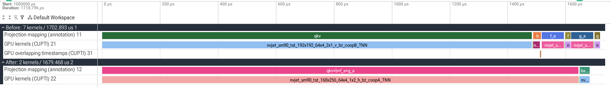

# GLM-5.3-Flash KDA projection profile

Actual PyTorch/CUPTI GPU events from the existing isolated projection capture. H20, BF16, hidden size 4096, 64 heads, head dimension 128; identical synthetic weights and inputs. Decode: 4 tokens per attention rank, attention TP1, CUDA Graph. Prefill: 8192 tokens per attention rank, attention TP8, eager. Parallel metadata is simulated on one GPU; this is not a complete serving-forward trace.

The two paths were recorded separately. The comparison traces select the third of five recorded invocations, align each first compute kernel to the same display origin, and preserve every selected event's measured duration and relative position. Process IDs and track names are changed only to display before and after together. Added projection-mapping rows are annotations derived from eager CPU/GPU correlation; they are not additional kernels. Overlapping recorded intervals use separate display tracks; no measured timestamp or duration is changed, and those display lanes do not establish physical concurrency. Original timestamps and source trace filenames are retained in event arguments. Device memory operations between the first and last compute kernels are included; compute counts and sums exclude them. This is a fixed selection, not the fastest sample.

| Stage | Compute kernels before → after | Mean compute-kernel sum over 5 calls (us) | Screenshot's selected call sum (us) |
|---|---:|---:|---:|
| Decode | 9 → 2 | 79.7072 → 61.4340 | 79.841 → 60.608 |
| Prefill | 7 → 2 | 1702.8172 → 1680.6330 | 1702.893 → 1679.468 |

Decode mean per-projection kernel sums (us): QKV56.2116 + b5.6836 + f_a5.7160 + f_b2.9892 + g_a5.7980 + g_b3.3088 =79.7072; fused first GEMM57.4340 + batched f_b/g_b4.0000 =61.4340. The original Q/K/V are already one matrix multiplication. Additional split-K reductions account for nine compute launches across six matrix multiplications. Mapping uses eager CPU external IDs and checks the complete ordered kernel-name groups against the CUDA Graph trace.

Prefill mean per-projection sums (us): QKV1483.5320 + b27.7696 + f_a76.9802 + f_b19.0274 + g_a76.6150 + g_b18.8930 =1702.8172; fused first GEMM1645.5608 + batched f_b/g_b35.0722 =1680.6330. Full precision values are available in the profile-data.json.

Kernel sums exclude launch gaps and differ from CUDA-event call latency. Capture source8d3f42a6a9f0a23cc223e45ee07cd3cbac862d55; the production implementation is unchanged at8c7eaa6925 (subsequent changes only modified and then removed the PR-added UT). No fresh GPU capture or full-model result is claimed.

Open `decode.trace.json` or `prefill.trace.json` in https://ui.perfetto.dev/, expand all tracks and select microseconds as the time format. Files are trace excerpts prepared for this comparison. Full original captures remain in the task evidence.
