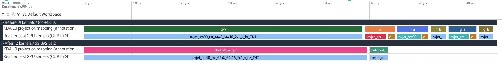
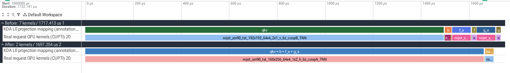

# KDA projection profiles from real GLM-5.3-Flash requests

Full checkpoint and live hidden states, captured through router → prefill → Mooncake → decode on 2 × 8 H20 GPUs. Sources: main 17ba2c2e7c7b81f31a8a9e693e7435ab262c16b4 and PR 8c7eaa69254416e0872ca093416b4bc08b32fbbb. Both use clean installed wheels; no runtime source patches.

| Phase / rank / shape | Before compute kernels | After | Before mean GPU kernel sum (µs) | After (µs) |
|---|---:|---:|---:|---:|
| decode, TP7, M1 | 9 | 2 | 86.0540 | 66.9246 |
| prefill, TP0, M8192 | 7 | 2 | 1717.0300 | 1697.1000 |

Each mean uses KDA layer 0 across 5 complete steps. Decode uses actual full CUDA Graph replay at global TP8/DP8 (attention TP1); prefill uses eager attention TP8. Both arms select the same physical rank: D7 / P0. Actual profile requests have 49,180 (decode) or 49,181 (prefill) input tokens and 64 output tokens, C1. Two matching long warmup requests precede capture; both KV caches are flushed before each role profile. All formal requests complete, with identical per-stage payload hashes/token counts.

Screenshots select the third step, not the fastest. Their selected-call totals therefore differ from the averages. GPU kernel durations and within-call offsets are unchanged; each path is visually aligned at its first projection kernel. Mapping guide rows are annotations, and the measured GPU rows retain original CUPTI event names, timestamps and graph IDs in event arguments. Kernel sums exclude memory operations and launch gaps.

## Per-operator GPU kernel sums (mean µs)

### prefill-baseline

| Operator | Mean GPU µs |
|---|---:|
| qkv | 1495.0452 |
| b | 28.3460 |
| f_a | 77.8498 |
| f_b | 19.4176 |
| g_a | 77.3698 |
| g_b | 19.0016 |

### prefill-candidate

| Operator | Mean GPU µs |
|---|---:|
| qkv + b + f_a + g_a | 1661.3112 |
| batched f_b + g_b | 35.7888 |

### decode-baseline

| Operator | Mean GPU µs |
|---|---:|
| qkv | 61.8942 |
| b | 5.9134 |
| f_a | 5.9968 |
| f_b | 3.3536 |
| g_a | 5.8878 |
| g_b | 3.0082 |

### decode-candidate

| Operator | Mean GPU µs |
|---|---:|
| qkv+b+f_a+g_a | 62.9184 |
| batched f_b+g_b | 4.0062 |

## Mapping and limitations

Prefill mapping uses actual CPU mm/bmm input shapes and BF16 input types joined to GPU kernels by External ID. Decode mapping identifies 34 ordered KDA signatures in each actual CUDA Graph step, merges their per-layer capture streams in time order, and selects layer 0. Kernel labels/shapes are checked against fixed-source forward order and the previously verified BF16 eager mapping; every duration reported here comes solely from the real-request traces.

These are descriptive projection timings, not a full-model speedup or a quality comparison. The earlier full-model performance/quality results remain unchanged. The initial stack-enabled bring-up capture incurred compilation/export overhead and was aborted; it is excluded. Formal captures use record_shapes=true and with_stack=false.

Artifacts: decode/prefill trace excerpts, profile-data.json with all 5 samples and original events, provenance.json with source/model/request identities and raw trace SHA256. Raw full-model traces and diagnostic logs remain in task evidence storage.
