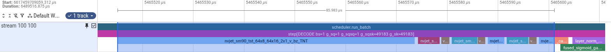
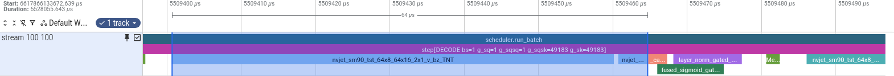
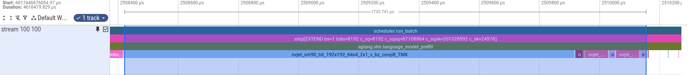
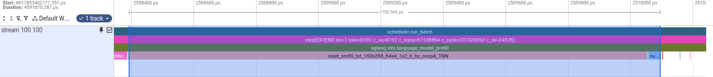

# Original-trace area selections: complete projection groups

Each image is a direct cropped screenshot of Perfetto v58.3-11fbaed83 with one original full trace gzip opened separately. The blue native area selection spans the first projection kernel's start through the last projection kernel's end on the original stream 100 track. The bracket above the selected region is Perfetto's own elapsed-time display. It includes inter-kernel gaps. No durations or labels were drawn onto the images.

The crop contains the native time ruler and selected GPU track, excluding the full-page sidebar and individual-kernel details panel. Kernel names, native step annotations and source timestamps are unchanged. Before/after use equal viewport scales within each phase (100 us decode / 1900 us prefill); each trace retains its own original time axis. Adjacent operations outside the blue selection are excluded.

These are KDA layer 0, step 3 of 5, on the same physical rank in both arms: decode TP7/DP7 and prefill TP0. The PR's existing mean timings remain five-step kernel sums. The screenshot bracket measures the complete selected group's elapsed time:

| Original trace | Compute kernels | Selected elapsed time (us, including gaps) | Kernel duration sum (us) |
|---|---:|---:|---:|
| decode-baseline | 9 | 85.983 | 82.943 |
| decode-candidate | 2 | 64.000 | 63.392 |
| prefill-baseline | 7 | 1732.741 | 1717.413 |
| prefill-candidate | 2 | 1702.566 | 1697.254 |

## Decode before

## Decode after

## Prefill before

## Prefill after

## Verification

`verification.json` records source file SHA256, exact selected and viewport timestamp bounds, cropped image bounds, and original/imported kernel events. The selected region contains all 9/2/7/2 projection kernels, individually verified against the originals by name, start and duration (within 1 ns conversion precision). Source hashes match the capture-time manifest. Original traces were not modified, filtered, renamed, rebased or merged.

The full traces have existing `slice_spill_overlapping_complete_event` import diagnostics; per-file counts are retained in the verification. All selected projection kernels are present unchanged. The standard Slices aggregate also includes enclosing GPU annotations (`scheduler.run_batch`, `step`, and for prefill `sglang.vlm.language_model.prefill`), so its unfiltered wall-duration sum would double-count nested intervals. These screenshots use the native selection bracket's elapsed time, not that aggregate. The kernel-only sums above exclude the annotation spans.

To reproduce manually, open the original gzip listed in the verification, locate the recorded step, pin stream 100, and drag-select from the first projection kernel's left edge to the last projection kernel's right edge. Capture the time ruler and selected track. `capture.cjs` applies the equivalent native Perfetto selection API and crops the browser screenshot; it does not alter the trace or screenshot pixels.

These area-selection crops supersede the earlier full-viewport individual-kernel screenshots in the PR body.
