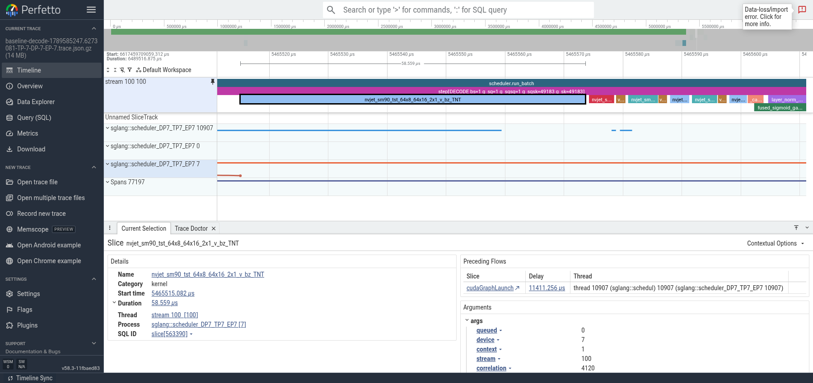
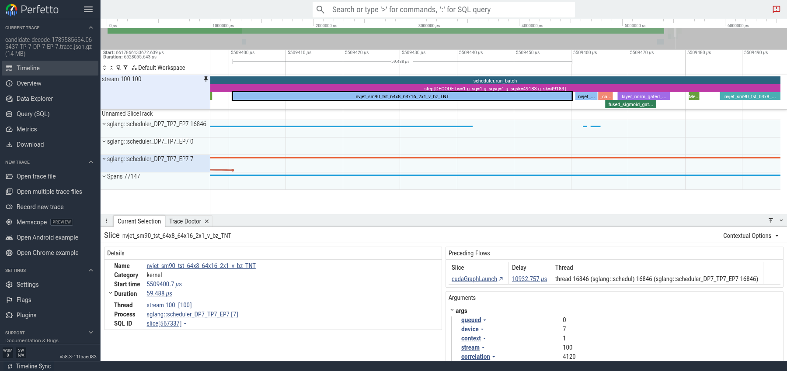
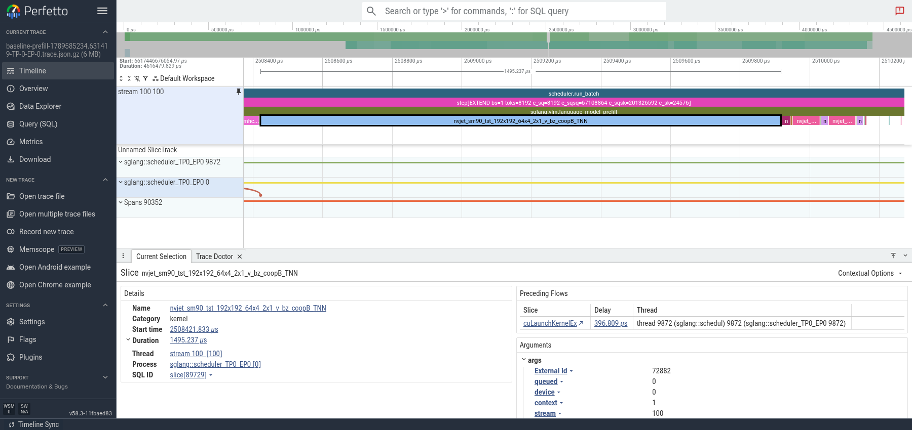
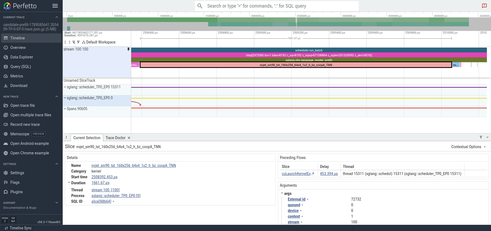

# Screenshots opened directly from original real-request traces

These four images are unedited full-viewport captures of Perfetto v58.3-11fbaed83, with each original `.trace.json.gz` opened separately. No trace filtering, event renaming, timestamp rebasing, stream merging, added annotation tracks, or image compositing was used. Native GPU step annotations were already present in the source traces.

Only standard viewing operations were applied: pin the original stream 100 track, collapse other track groups, select the first projection kernel, and zoom the timeline. Before/after use the same scale within each phase (100 us for decode; 1900 us for prefill), with each trace retaining its own original time axis. Source filenames, original kernel names, selected-kernel duration, process and stream remain visible. Adjacent operations shown after the projection group are context and are not included in the counts below.

The selection is KDA layer 0 in the third of five captured steps, not the fastest step. The detail panel measures only the selected first kernel, not the entire projection group. Selected-step projection measurements:

| Trace | Compute kernels | Kernel sum (us) | First start to last end (us) |
|---|---:|---:|---:|
| decode-baseline | 9 | 82.943 | 85.983 |
| decode-candidate | 2 | 63.392 | 64.000 |
| prefill-baseline | 7 | 1717.413 | 1732.741 |
| prefill-candidate | 2 | 1697.254 | 1702.566 |

## Decode before



## Decode after



## Prefill before



## Prefill after



## Verification and navigation

`verification.json` records the original file paths and SHA256 values, exact source and viewport timestamps, selected SQL slice IDs, and the imported kernel events. All 9/2/7/2 selected compute kernels match the original names, timestamps and durations (within 1 ns conversion precision). Source SHA256 values also match the capture-time manifest; originals were not modified.

Perfetto reports `slice_spill_overlapping_complete_event` import diagnostics on these full traces. The UI indicator is retained, and per-file counts are recorded in `verification.json`. The comparison does not claim a clean import of every event; the selected projection kernels were checked individually and are all present unchanged.

To reproduce manually, open the source gzip named in `verification.json`, locate the GPU step below, pin stream 100, and use the recorded original timestamp range. Perfetto's displayed offsets use each trace's own start; raw JSON timestamps are not these relative offsets.

Decode step:

```text
step[DECODE bs=1 g_sq=1 g_sqsq=1 g_sqsk=49183 g_sk=49183]
```

Prefill step:

```text
step[EXTEND bs=1 toks=8192 c_sq=8192 c_sqsq=67108864 c_sqsk=201326592 c_sk=24576]
```

These images supersede the earlier aligned comparison screenshots in the PR body. The older derived excerpts remain historical artifacts and should not be described as original-trace screenshots.
